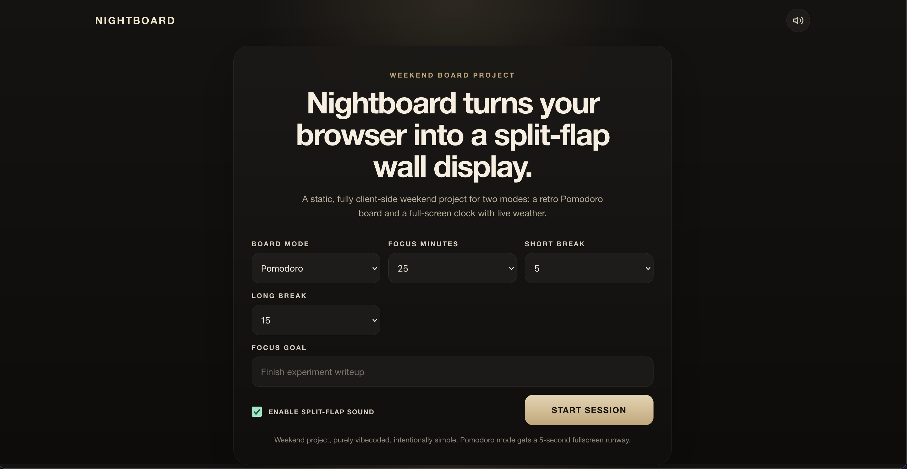
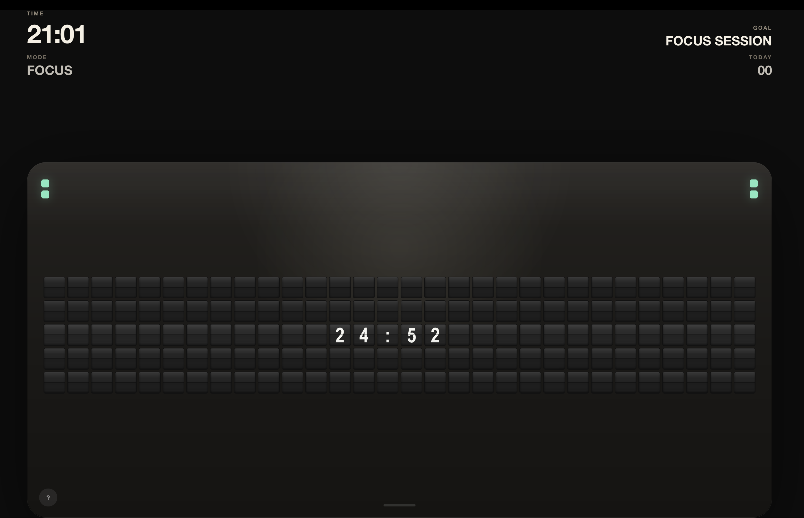

# Nightboard

Nightboard is a retro split-flap browser board for two moods:

- a focused Pomodoro board for one task at a time
- a full-screen clock board with city + weather

It is a static browser app. No accounts. No backend. No build step. Open it, fullscreen it, let it run.

Built as a weekend project. Purely vibecoded. Intentionally simple.
*Motivation from Flipoff
## Live Site

[https://ahmad-mukhtaar.github.io/nightboard/](https://ahmad-mukhtaar.github.io/nightboard/)

## Community

- [Contributing guide](CONTRIBUTING.md)
- [Code of Conduct](CODE_OF_CONDUCT.md)
- [Security notes](SECURITY.md)

## Screenshots

### Setup



### Pomodoro Board



Clock Board screenshot can be added once the final retro clock capture is ready.

## Modes

### Pomodoro

- focus, short break, and long break timers
- custom minute values for all three timers
- 5-second prestart so you can go fullscreen
- single-goal board with keyboard-first controls

### Clock Board

- full retro tile field in fullscreen
- live `HH:MM:SS`
- city and weather inside the board
- weather shown as temperature + condition

## Keyboard Shortcuts

| Key | Action |
| --- | --- |
| `F` | Toggle fullscreen |
| `M` | Toggle sound |
| `B` | Return to setup |
| `R` | Reset / refresh current board |
| `Space` | Pause / resume Pomodoro |
| `Escape` | Exit fullscreen |

## Local Development

Serve the repo with any static file server.

```bash
python3 -m http.server 8080
```

Then open [http://localhost:8080](http://localhost:8080).

Run tests with:

```bash
npm test
```

## GitHub Pages

This repo already includes a GitHub Pages workflow in `.github/workflows/deploy-pages.yml`.

Suggested public setup:

1. Push this code to your own GitHub repo.
2. Keep the workflow on `main`.
3. Enable GitHub Pages in the target repo.
4. Verify the deployed URL after the Pages workflow runs.

Do not publish from the original upstream unless you actually control it.

## Privacy Note

Pomodoro mode is fully local.

Clock mode sends the typed city name from the browser to Open-Meteo's geocoding and weather APIs so it can resolve the location and fetch current conditions. No auth, account, or server-side storage is involved in this repo.

## Project Notes

- static HTML/CSS/JS only
- browser `localStorage` stores lightweight preferences such as mode, timer values, city, and goal
- weather fetches are client-side
- split-flap sound is embedded locally in the repo

## Security

See [SECURITY.md](SECURITY.md) for the lightweight public-readiness notes for this project.

## License

[MIT](LICENSE)
